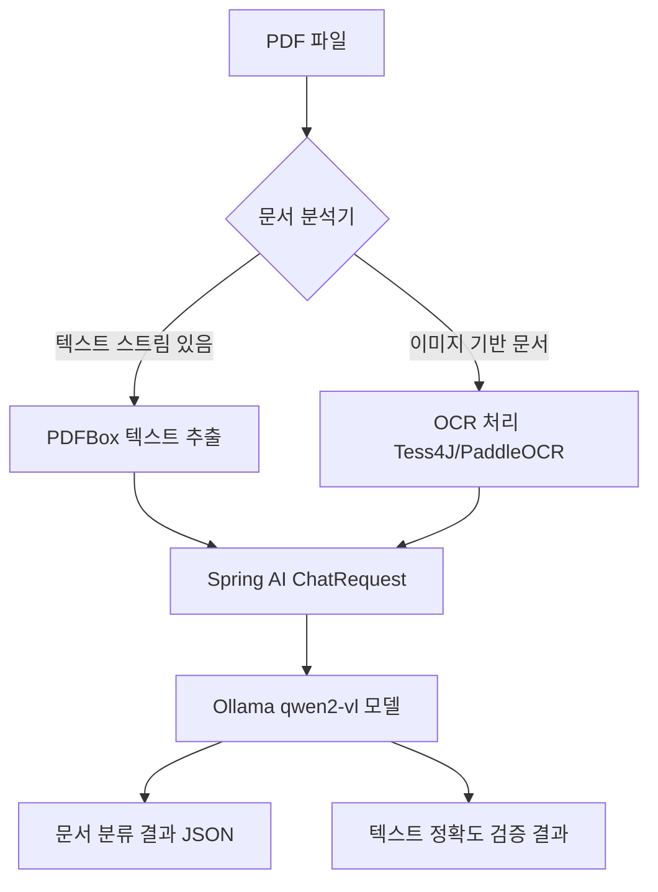

# 아키텍처

원본 설계서(「[기술 가이드] Spring AI 기반 OCR 문서 분류 및 검증 설계서」) 3장의 다이어그램을 그대로 따른다.

## 코드와의 매핑

| 다이어그램 노드 | 구현 클래스 |
|---|---|
| B. 문서 분석기 | `PdfExtractService#analyzeTextAvailability` |
| C. PDFBox 텍스트 추출 | `PdfExtractService#extractText` |
| D. OCR 처리 | `OcrService` / `Tess4jOcrService` |
| E~F. Spring AI ChatRequest → Ollama | `DocumentProcessorService#classifyAndVerify`, `SpringAiConfig#documentChatClient` |
| G/H. 분류·검증 결과 | `dto/AnalysisResult`, `dto/AnalysisResponse` |
